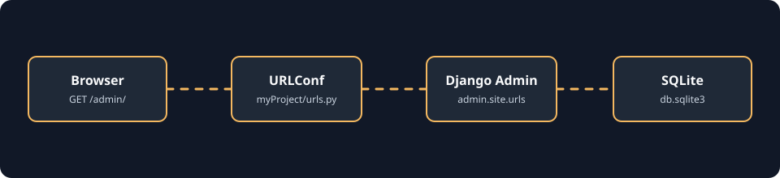

<a id="top"></a>

# Django Project Foundation

> A minimal Django 5.2.1 project scaffold for learning project configuration, administration, SQLite setup, and standard ASGI/WSGI entry points.

## Context Menu

| Project area                          | Open                                                                                              |
| ------------------------------------- | ------------------------------------------------------------------------------------------------- |
| Project purpose and verified behavior | [Description](#description) · [Key Features](#key-features)                                       |
| Dependencies and setup                | [Tech Stack](#tech-stack) · [Getting Started](#getting-started)                                   |
| Configuration                         | [Environment Variables](#environment-variables) · [Django Template Setup](#django-template-setup) |
| Request and data flow                 | [Animated Data Flow Diagram](#animated-data-flow-diagram) · [Context Data](#context-data)         |
| Routes and interaction                | [Navigation](#navigation) · [Pages and Tools Setup](#pages-and-tools-setup) · [Usage](#usage)     |
| Project files and next steps          | [Project Structure](#project-structure) · [Possible Alternatives](#possible-alternatives)         |
| Legal and ownership                   | [License](#license) · [Contact](#contact)                                                         |

## Description

This project gives Django learners a clean starting point for understanding the framework's generated project structure, built-in administration route, database configuration, and deployment entry points. It currently provides Django's standard admin site only; no custom homepage or business workflow is implemented.

## Contents

- [Context Menu](#context-menu)
- [Description](#description)
- [Key Features](#key-features)
- [Tech Stack](#tech-stack)
- [Getting Started](#getting-started)
- [Environment Variables](#environment-variables)
- [Animated Data Flow Diagram](#animated-data-flow-diagram)
- [Django Template Setup](#django-template-setup)
- [Context Data](#context-data)
- [Navigation](#navigation)
- [Pages and Tools Setup](#pages-and-tools-setup)
- [Usage](#usage)
- [Project Structure](#project-structure)
- [Possible Alternatives](#possible-alternatives)
- [License](#license)
- [Contact](#contact)

## Key Features

- **Django project scaffold:** Includes `manage.py`, project settings, URL configuration, and standard ASGI/WSGI modules.
- **Built-in administration:** Exposes Django Admin at `/admin/` through `django.contrib.admin.site.urls`.
- **SQLite database:** Configures SQLite at the project root as `db.sqlite3`.
- **Built-in Django apps:** Enables admin, authentication, content types, sessions, messages, and static files.
- **Deployment entry points:** Provides `myProject.asgi.application` and `myProject.wsgi.application`.
- **Focused learning scope:** Contains no custom app, models, views, forms, templates, migrations, tests, or custom admin registrations.

## Tech Stack

| Technology    | Verified use                                                   |
| ------------- | -------------------------------------------------------------- |
| Python        | Runtime for Django management and entry-point modules          |
| Django 5.2.1  | Web framework, middleware, authentication, sessions, and admin |
| SQLite        | Database engine configured in `settings.py`                    |
| ASGI and WSGI | Standard application interfaces for deployment servers         |

## Getting Started

### Prerequisites

- Python 3.10 or newer recommended for Django 5.2.1.
- A terminal opened in `Django/3rd_class/myProject`.

### Installation

```powershell
cd Django\3rd_class\myProject
python -m venv .venv
.venv\Scripts\Activate.ps1
python -m pip install --upgrade pip
python -m pip install Django==5.2.1
```

This project does not include a `requirements.txt` file. Django 5.2.1 is the only dependency evidenced by the source configuration.

### Database Setup

Apply Django's built-in migrations to the configured SQLite database:

```powershell
python manage.py migrate
python manage.py check
```

### Create an Admin User

Create a local administrator account before signing in to `/admin/`:

```powershell
python manage.py createsuperuser
```

### Run the Development Server

```powershell
python manage.py runserver
```

Open [http://127.0.0.1:8000/admin/](http://127.0.0.1:8000/admin/) in a browser. This is a development setup and is not production-ready as currently configured.

## Environment Variables

No external environment variables or `.env` file are required by the current source. The project assigns its settings module internally in `manage.py`, `asgi.py`, and `wsgi.py`:

```env
DJANGO_SETTINGS_MODULE=myProject.settings
```

The current `settings.py` also contains a development `SECRET_KEY`, `DEBUG = True`, and `ALLOWED_HOSTS = []`. For production, load secrets from the environment, disable debug mode, and configure allowed hosts.

## Animated Data Flow Diagram

The diagram represents the implemented admin request path. SVG vectors are styled with CSS, and the dashed connectors animate without rasterizing the image, so the diagram stays sharp and browser-renderable at different sizes.



[Open the DFD SVG directly in a browser](./docs/django-admin-dfd.svg)

### DFD Description

| Stage             | Source of truth        | Responsibility                                                          |
| ----------------- | ---------------------- | ----------------------------------------------------------------------- |
| Browser           | `/admin/`              | Sends the admin request and displays the returned HTML.                 |
| URL configuration | `myProject/urls.py`    | Routes `admin/` to Django's admin URL patterns.                         |
| Django Admin      | `django.contrib.admin` | Provides the built-in administration interface and authentication flow. |
| SQLite            | `db.sqlite3`           | Stores data used by Django's built-in applications after migrations.    |

[Back to Contents](#context-menu)

## Django Template Setup

The current project has no custom templates and leaves the project-level template directory empty. Django can still discover templates inside installed apps because `APP_DIRS` is enabled:

```python
# myProject/settings.py: current configuration
TEMPLATES = [
	{
		'BACKEND': 'django.template.backends.django.DjangoTemplates',
		'DIRS': [],
		'APP_DIRS': True,
	},
]
```

If a future custom app is added, its standard template setup would look like this. The following is an extension example, not an implemented file in this project:

```python
# myProject/settings.py
TEMPLATES = [
	{
		'BACKEND': 'django.template.backends.django.DjangoTemplates',
		'DIRS': [BASE_DIR / 'templates'],
		'APP_DIRS': True,
	},
]
```

```text
templates/
└── example.html
```

[Back to Contents](#context-menu)

## Context Data

There is no custom view in the current project, so no project-owned context dictionary is passed to a template. Django Admin manages its own internal request context.

A future custom view could pass context like this:

```python
from django.shortcuts import render

def example(request):
	context = {'title': 'Example page'}
	return render(request, 'example.html', context)
```

This snippet is a possible extension only; `example` is not currently defined or routed.

[Back to Contents](#context-menu)

## Navigation

The URL configuration contains one explicit project route. It has no custom URL name.

| URL       | Handler           | URL name               | Result                         |
| --------- | ----------------- | ---------------------- | ------------------------------ |
| `/admin/` | `admin.site.urls` | Django admin namespace | Opens the built-in admin site. |

```python
# myProject/urls.py: current configuration
from django.contrib import admin
from django.urls import path

urlpatterns = [
	path('admin/', admin.site.urls),
]
```

There is no configured route for `/`, and no custom navigation page is implemented. If a future page is added, a named route can be introduced like this:

```python
path('example/', views.example, name='example')
```

Then a Django template could reverse it with:

```django

```

Both snippets describe possible future additions, not current routes.

[Back to Contents](#context-menu)

## Pages and Tools Setup

This project is a generated Django foundation, so its current interface is intentionally small. The sequence below covers every available page and the setup tools needed to reach it. Complete the steps in order from the project directory.

### Step 1: Open the Project Directory

All Django commands must run beside `manage.py`. From the repository root, enter this project first:

```powershell
cd Django\3rd_class\myProject
```

Confirm the expected project files are available:

```powershell
Get-ChildItem
```

Expected entries include `manage.py`, `db.sqlite3`, the `myProject` package, and `README.md`.

### Step 2: Create the Python Environment

Create an isolated virtual environment so the project's Django dependency does not modify the global Python installation:

```powershell
python -m venv .venv
```

Activate it in PowerShell:

```powershell
.venv\Scripts\Activate.ps1
```

After activation, the terminal prompt normally includes `(.venv)`. Upgrade packaging tools and install the exact Django version identified by `settings.py`:

```powershell
python -m pip install --upgrade pip
python -m pip install Django==5.2.1
```

### Step 3: Check the Django Installation

Use the project management tool to confirm Django can load `myProject.settings`:

```powershell
python manage.py check
```

Expected result:

```text
System check identified no issues (0 silenced).
```

This command validates configuration without changing the database. It is the quickest diagnostic tool when the project fails before the server starts.

### Step 4: Prepare the SQLite Database

The project uses `DATABASES['default']` in `myProject/settings.py` and stores data in `db.sqlite3`. Apply Django's built-in migrations with:

```powershell
python manage.py migrate
```

This creates or updates tables used by the built-in admin, authentication, content types, sessions, and messages applications. There are no custom models or project-owned migrations in this scaffold.

### Step 5: Create the Admin Account

The `/admin/` page requires an authenticated staff user. Create one interactively:

```powershell
python manage.py createsuperuser
```

Enter the requested username, email address, and password. The command writes the account to the SQLite database; it does not create a custom model or page.

### Step 6: Start the Development Server

Start Django's local HTTP server:

```powershell
python manage.py runserver
```

The default address is:

```text
http://127.0.0.1:8000/
```

Keep this terminal running while using the page. Stop it with `Ctrl+C`.

### Step 7: Use the Available Page

The project defines exactly one URL pattern:

```text
http://127.0.0.1:8000/admin/
```

This page is provided by Django's built-in `admin.site.urls` handler. Sign in with the superuser from Step 5. Because the project has no custom models or admin registrations, the page exposes only the built-in Django administration capabilities.

### Step 8: Understand Unavailable Pages

The root URL is not configured:

```text
http://127.0.0.1:8000/
```

It does not map to a project homepage. There are also no implemented custom pages for dashboards, profiles, CRUD, APIs, forms, or reports. Adding any of those requires a Django app, URL pattern, view, and usually a template or serializer; none of those are currently present.

### Step 9: Understand the Configuration Tools

The generated project package provides these operational entry points:

| File                    | Tool or interface        | Current responsibility                                                                                       |
| ----------------------- | ------------------------ | ------------------------------------------------------------------------------------------------------------ |
| `manage.py`             | Django command-line tool | Loads `myProject.settings` and runs commands such as `check`, `migrate`, `createsuperuser`, and `runserver`. |
| `myProject/settings.py` | Runtime configuration    | Defines installed apps, middleware, templates, SQLite, static URL, timezone, and security defaults.          |
| `myProject/urls.py`     | URL router               | Maps only `/admin/` to Django Admin.                                                                         |
| `myProject/asgi.py`     | ASGI application         | Exposes `myProject.asgi.application` for asynchronous-capable deployment servers.                            |
| `myProject/wsgi.py`     | WSGI application         | Exposes `myProject.wsgi.application` for WSGI deployment servers.                                            |
| `db.sqlite3`            | Local database           | Stores migrated built-in Django data and the created admin account.                                          |

### Step 10: Run the Full Local Sequence

For a new checkout, the complete sequence is:

```powershell
cd Django\3rd_class\myProject
python -m venv .venv
.venv\Scripts\Activate.ps1
python -m pip install --upgrade pip
python -m pip install Django==5.2.1
python manage.py check
python manage.py migrate
python manage.py createsuperuser
python manage.py runserver
```

Then open:

```text
http://127.0.0.1:8000/admin/
```

[Back to Contents](#context-menu)

## Usage

### Start the project

```powershell
python manage.py migrate
python manage.py createsuperuser
python manage.py runserver
```

### Open Django Admin

```text
http://127.0.0.1:8000/admin/
```

Sign in with the superuser created during setup. The available administration behavior comes from Django's built-in installed apps; this project has no custom models registered in admin.

### Verify configuration

```powershell
python manage.py check
```

Expected result:

```text
System check identified no issues (0 silenced).
```

[Back to Contents](#context-menu)

## Project Structure

```text
myProject/
├── manage.py                 # Django command-line entry point
├── db.sqlite3                # SQLite database file
├── myProject/
│   ├── __init__.py
│   ├── settings.py            # Django configuration
│   ├── urls.py                # /admin/ route
│   ├── asgi.py                # ASGI application entry point
│   └── wsgi.py                # WSGI application entry point
└── README.md
```

[Back to Contents](#context-menu)

## Possible Alternatives

These professional capabilities are not implemented in the current scaffold:

- **Custom application layer:** Add a Django app for domain-specific models, views, forms, URLs, and admin registrations.
- **User-facing page:** Add a named homepage route, view, template, and static assets.
- **Environment-based settings:** Move the secret key, debug flag, and allowed hosts to environment-backed configuration.
- **Automated tests:** Add URL, admin access, view, and model tests as custom behavior is introduced.
- **Production database:** Replace local SQLite with a managed database for a deployed application.
- **Static asset pipeline:** Configure collected and versioned CSS, JavaScript, and image assets.
- **Production deployment:** Run the ASGI or WSGI application behind a production server with secure settings.

[Back to Contents](#context-menu)

## License

This project is released under the [MIT License](./LICENSE).

[Back to Contents](#context-menu)

## Contact

- **Project maintainer:** Mehedi Alam
- **Email:** mehedialam806@gmail.com
- **Project:** [DIPTI WADP Web Application Development Practices](https://github.com/MehediAlam49/DIPTI_WADP__HW-Practices)
- **Profile:** [MehediAlam49](https://github.com/MehediAlam49)

[Back to Contents](#context-menu)
